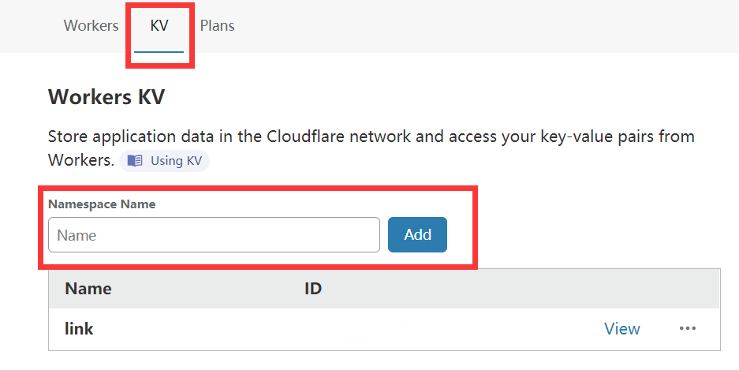
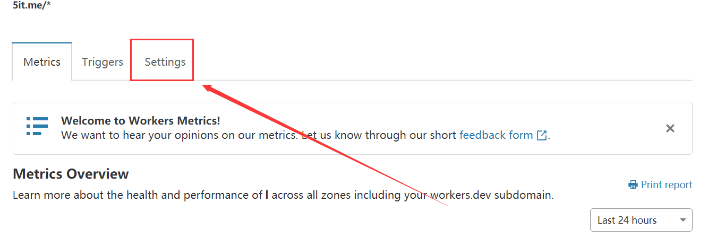
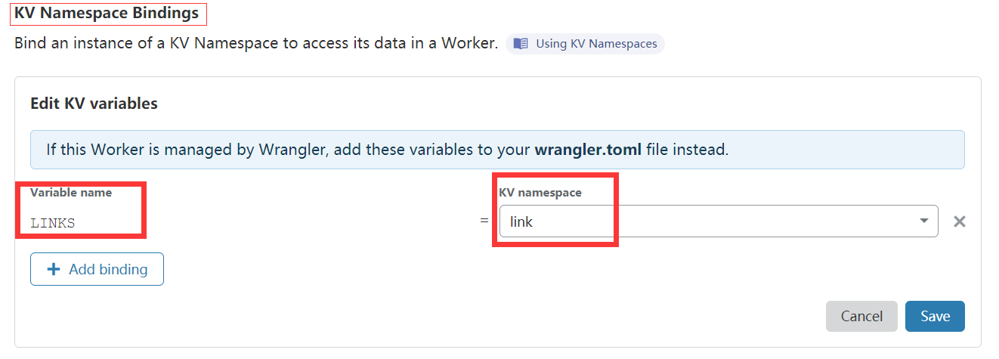
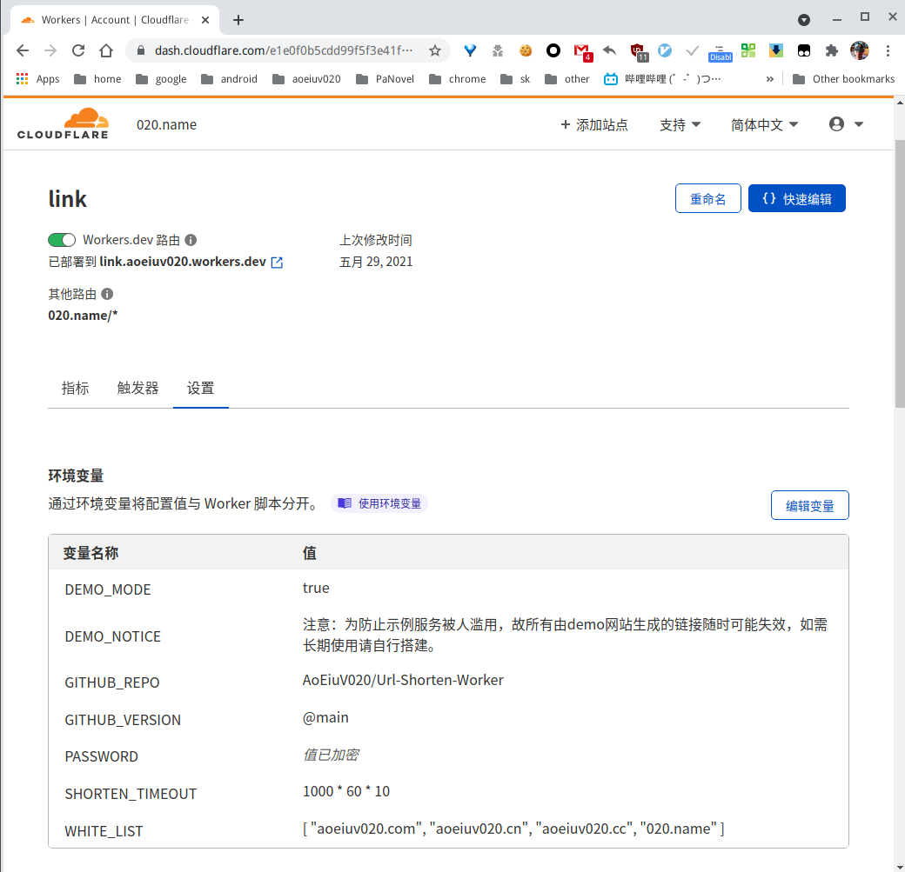

# 020短链
利用Cloudflare Worker实现的简单免费的短链接平台，  
主要支持自用以及防滥用演示，  

# API

[中文API文档](API.md)

# Getting start
### 去Workers KV中创建一个命名空间

Go to Workers KV and create a namespace.

### 去Worker的Settings选选项卡中绑定KV Namespace

Bind an instance of a KV Namespace to access its data in a Worker.

### 其中Variable name填写`LINKS`, KV namespace填写你刚刚创建的命名空间

Where Variable name should set as `LINKS` and KV namespace is the namespace you just created in the first step.

### 复制本项目中的`index.js`的代码到Cloudflare Worker 

Copy the `index.js` code from this project to Cloudflare Worker. 

### 调整超时设置

演示模式生成的短链接超时无法访问，  
白名单或者密码正确情况超时设置无效，  
修改脚本开头的变量*shorten_timeout*, 单位毫秒，0表示不设置超时，

### 调整白名单

白名单中的域名设置短链接无视超时，  
修改脚本开头的变量*white_list*, 是个json数组，写顶级域名就可以，自动通过顶级域名和所有二级域名，

### 关闭演示模式

只有演示模式开启才允许访客无密码添加非白名单地址，超时短链接会失效，  
修改脚本开头的变量*demo_mode*，为true开启演示，为false无密码且非白名单请求不受理，

### 自动删除演示记录

针对演示模式开启情况下的超时失效的短链接记录是否自动删除，  
修改脚本开头的变量*remove_completely*，为true自动删除超时的演示短链接记录，否则仅是标记过期，以便在后台查询历史记录，

### 修改密码

网页有个隐藏输入框可以输入密码，  
密码正确情况无视白名单和超时设置，且支持自定义短链接，  
修改脚本开头的变量*password*，这个私密信息比较建议直接在环境变量里配置，

### 修改短链长度

短链长度就是随机生成的key也就是短链接的path部分的长度，  
长度不够时容易出现重复，遇到重复时会自动延长，  
修改脚本开头的变量*default_len*,

### 以上几个配置都可以在worker -> 设置 -> 环境变量中配置，key均为对应大写，

### 点击Save and Deploy

Click Save and Deploy

# Demo
https://020.name
 
Note: Because someone abuse this demo website, all the generated link may be deleted at any time. For long-term use, please deploy your own.

注意：由于该示例服务被人滥用，用于转发诈骗网站，故所有由demo网站生成的链接随时可能失效，如需长期使用请自行搭建。

## 感谢
项目基于[xyTom/Url-Shorten-Worker](https://github.com/xyTom/Url-Shorten-Worker)[(MIT)](https://github.com/xyTom/Url-Shorten-Worker/blob/main/LICENSE)  
1. 改进了正则匹配，
1. 添加了超时判断处理，
1. 添加了白名单支持，
1. 添加了演示模式，
1. 添加了隐藏密码支持，
1. 添加了隐藏自定义短链接支持，
1. 所有配置可以脱离脚本在环境变量配置，
1. 支持回车键提交，
1. 生成的短链接包含协议https，
1. 添加了短链长度设置和自动延长，
1. 支持开关自动删除演示过期记录，
